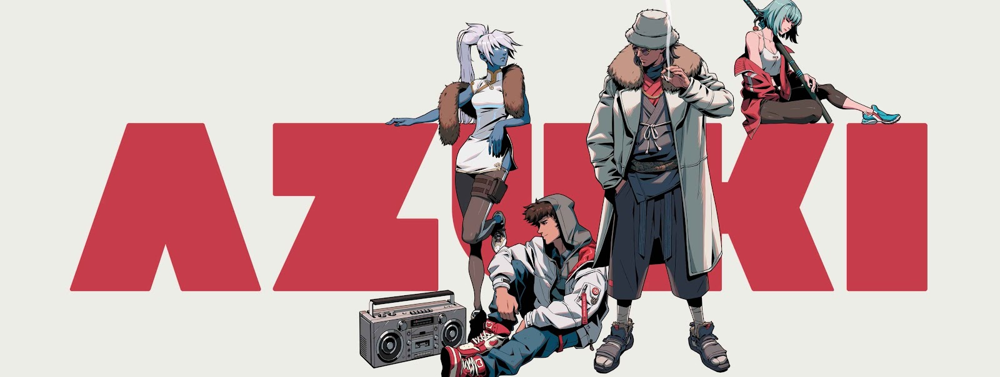

# 什么是Azuki

<figure><figcaption></figcaption></figure>

Azuki是一组日系动漫风格的10000张[NFT集合](https://ethereum.org/zh/nft/)，它由 [Chiru Labs](https://www.chirulabs.com/) 推出。NFT用作其社区「The Garden 」的会员通行证，旨在共同创造去中心化的社区与Web3品牌。Azuki的每一个NFT都是独一无二，其发型、眼睛、嘴巴、脖子、服装配饰和背景类型等都有差异。

<figure><figcaption></figcaption></figure>

Azuki社区的目标是为社区创建去中心化的元宇宙品牌，社区是一切活动的开始，招募全球大使，共同推动Web3.0和开放的互联网。

同时开展线下活动，街头品牌合作，拓展实物收藏品，以及音乐艺术家的合作等方式，连接物理和数字世界，探索新的玩法；

激活Web2.0中被熟知又处于休眠的IP，重新赋予生机；为物理世界和数字世界之间的桥梁提供了一个创造新型媒体的游乐场。

目前，Azuki社区在Web3.0领域推出了各种NFT协议标准与新颖的玩法，如ERC721A协议、PBT协议、NFT 碎片化、Azuki伙伴BEANZ系列等。


详情可参考：[Azuki与Web3](../web3/)


同时，Azuki社区也在同步开展一系列线下活动，旨在连接物理和数字世界，如与AMBUSH、Red Bull F1等合作。


详情可参考：[Azuki与Web2](../web2/)


<figure><figcaption></figcaption></figure>

****

###

