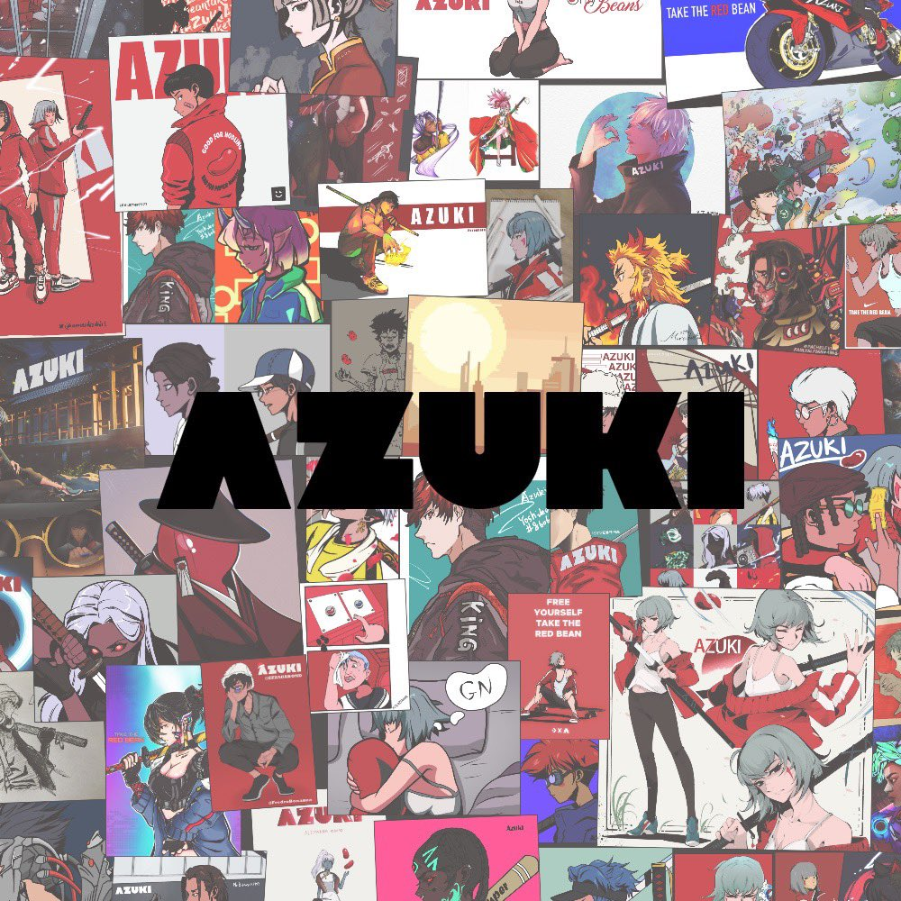

# 愿景、宣言和价值观

<figure><figcaption></figcaption></figure>

### 愿景：

为社区构建最大的去中心化元宇宙品牌，通过摆脱由多数人的控制，来创造一个拥抱所有人的世界。

### 宣言：

次世代的浪潮来了... 这一波浪潮不同寻常 打破垄断的壁垒 打造开放的社区 和朋友们一起创造互联网文化 我们对那些不理解的人说：早安 他们以后会懂的

我们欢迎勇敢的你来到一个未知的新世界 一个不是由多数人创造，少数人独占 而是由更多人创造，多数人共有的新世界 从小豆园里成长出的豆子伙伴们终会成为我们的家人。

我们一起发展。 我们一起建设。 我们一起成长。

准备好接受红豆了吗？

### 价值观：

社区优先，只做傻事，相信过程。

