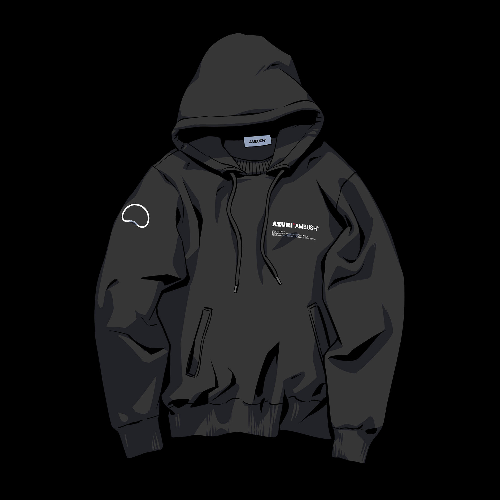

# Azuki x AMBUSH®

2022年11月, Azuki宣布与日本时尚品牌[AMBUSH®](https://www.ambushdesign.com/)合作，推出限量胶囊系列：两款灰色和黑色连帽衫，以及两款银色和金色吊坠项链。

该系列由AMBUSH®︎创始人Yoon Ahn和Verbal、以及Azuki创始人Zagabond亲自设计。合作的灵感来自 Shao 的勇敢精神和坚韧，是传统东方工艺、简约设计和 web3 文化的大胆代表。

而在此次的合作中还值得注意的是其采用了 Azuki 的 PBT（即由 Azuki 推出的全新代币标准），实现了将现实物品绑定到以太坊区块链上，PBT 用户能够在区块链上追踪正品的来源，并在手机上扫描芯片以查找 AMBUSH 运动衫。

通过该项目与AMBUSH的最新合作， Azuki世界将继续促进Web3文化与街头服饰之间的和谐。


想了解更多PBT的知识？查看[PBT协议](../web3/pbt.md)


#### 相关视频：



#### AZUKI X AMBUSH® 连帽衫

徽标印花棉质连帽衫，带有 AMBUSH® 和 Azuki 徽标以及红色墨水“IKZ”印章设计，是 Azuki 口号“ikuzo”的缩写。嵌入式 BEAN 芯片将物理连帽衫与以太坊区块链上的 PBT 联系起来。日本制造。

.png>).png>)

#### AZUKI X AMBUSH® 金龙吊坠

金吊坠饰有雕刻的金龙和简约的印章设计。吊坠底座刻有“IKZ”字样，可用作邮票。日本制造。

材质 925 银 + 18k 镀金&#x20;

链长50cm（40-45-50cm可调）&#x20;



<figure><figcaption></figcaption></figure>

#### AZUKI X AMBUSH® 银龙吊坠

银吊坠的灵感来自传统的印加邮票，并刻有龙纹。吊坠配有一个可拧开的盖子，露出一个雕刻的“IKZ”字样，可用作邮票。日本制造。

材料银 925&#x20;

链长50cm（40-45-50cm可调）&#x20;

<figure><figcaption></figcaption></figure>
