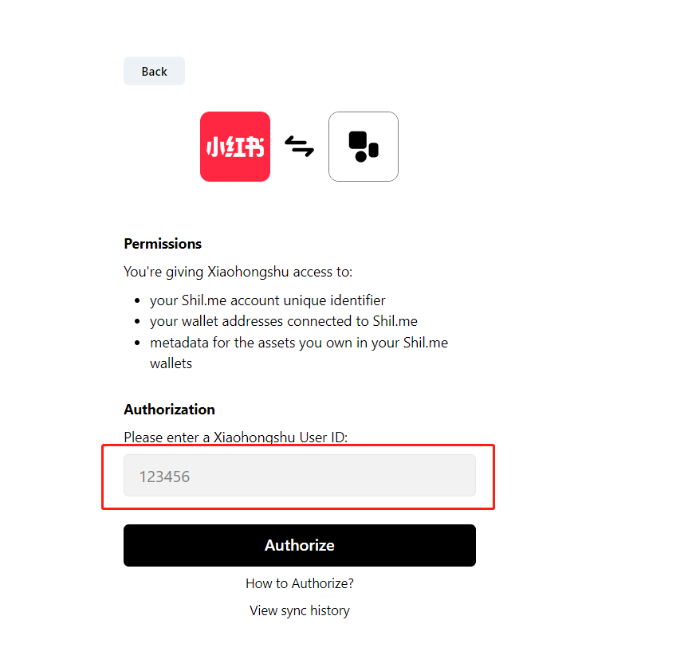

# PBT协议

## 什么是PBT

2022年10月18日，Azuki社区发布了一种全新的开源 Token 标准——[Physical Backed Token (PBT)](https://www.pbt.io/)。PBT是一种基于 ERC721 的以太坊令牌标准。该标准支持将现实物品绑定到以太坊区块链上，以实现去中心化的身份验证和跟踪实体物品的所有权，且整个流程完全部署在链上，不需要任何中心化服务器介入。

基于该标准，Scan to Own 的模式应运而生，该模式致力于通过与硬件的结合实现物理物品所有权的去中心化转移，以为用户带来全新的体验。

<figure><figcaption></figcaption></figure>

## PBT协议特点

* **去中心化**

传统的身份验证系统依赖于集中式服务器，PBT 则不同。身份验证过程从其核心分散到一个标准，该标准基于使用能够通过非对称公私密钥对进行自我证明的芯片。

* **可扩展**

PBT 有意对您使用它构建的体验保持中立。从解锁数字体验到参与现实生活中的探索，再到交易经过验证的物品——PBT 为构建体验奠定了中立的基础。

* **开源**

PBT 是完全开源的，可供社区免费构建。它是根据MIT许可证发布的。我们鼓励就该技术进行公开讨论和讨论。

* **无需信任**

作为以太坊上的代币标准，没有任何一个实体拥有验证物品或验证所有权的单一权利——所有人都可以自由地验证、验证和在技术之上构建体验。

## **如何工作**

### BEAN 芯片 

<figure><figcaption></figcaption></figure>

Azuki社区与[Kong](https://arx.org/)合作创建了支持区块链的身份验证网络芯片（“BEAN 芯片”），这是一种可自行生成非对称密钥对的物理加密芯片。PBT 使硬件能够创造一种我们喜欢称之为“扫描到自己”的新体验。

### SCAN-TO-OWN 

用你的手机扫描芯片允许 PBT 被铸造或数字转移到所有者的钱包。这允许实体物品的当前所有者也拥有​​ PBT，PBT 可验证地验证该物品并将该物品与他们选择的钱包中的数字令牌相关联。

### 从OWNER到OWNER 

如果实体物品被出售或赠送给新所有者，则后续所有者可以扫描拥有相同的实体项目，从而以去中心化的方式将 PBT 从先前所有者转移到新所有者。

## 使用案例 

* **商品的去中心化认证**：只需用手机扫描即可对实物进行认证。
* **跟踪实物商品的所有权沿袭**：可验证地证明物品的过去和现在的所有者，使品牌能够为其受众建立产品体验。
* **使用实体产品创造数字体验**：拥有数字代币可以解锁实体掉落，现在拥有实体产品可以解锁数字体验。

## 了解更多



